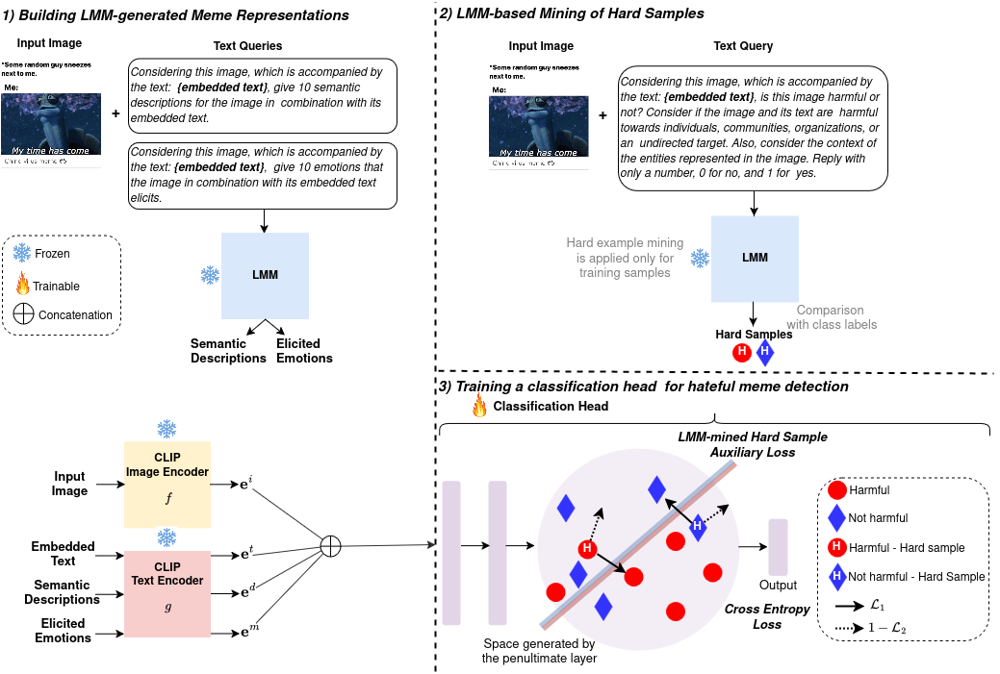
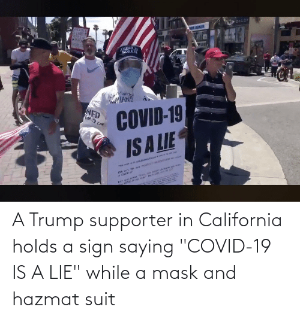
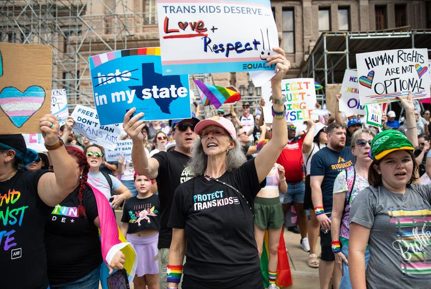

# Improving multimodal hateful meme detection exploiting LMM-generated knowledge


## Datasets

[Harm-C](https://www.kaggle.com/datasets/samuelmathew28/harmeme)

[PrideMM](https://github.com/SiddhantBikram/MemeCLIP)


## Feature Representations and Trained Models
We used [MiniGPT-4](https://github.com/Vision-CAIR/MiniGPT-4) for obtaining LMM-based knowledge using the prompts described in the paper. We used [ViT-L-14 CLIP](https://github.com/openai/CLIP) and [LongCLIP-L](https://github.com/beichenzbc/Long-CLIP) for extracting the image and text embeddings for building the input meme representations. 
The feature representations, built using the proposed method, and the trained models for Harm-C and PrideMM datasets (using both the CLIP and LongCLIP models) can be downloaded using the [link](https://drive.google.com/drive/folders/10unJDls369wys_UYRZtq1C7-hOAhn1bq?usp=sharing).


## Training and Evaluation
- Training
```bash
python3 train.py --weight 0.05 --k 1
```

- Evaluation
```bash
python3 eval.py --weights_path /path/to/harmc_clip.pth
```

## Evaluation Results
Evaluation results of the proposed method in terms of test accuracy (%) (5 runs) on Harm-C and PrideMM.

| Method | Harm-C | PrideMM |
| -------------| ------------- |------------- |
| LMM-CLIP |  86.33  | 76.31 |
| LMM-LongCLIP |  87.23  | 75.89 |


##  Qualitative Results
| Meme | Semantic Descriptions | Elicited Emotions |
| -------------| ------------- |------------- |
|  | 1. A person holding a sign that reads "COVID-19 IS A LIE" while wearing a mask and hazmat suit. 2. A protester in California holding a sign with a political message. 3. A person demonstrating against COVID-19, wearing protective gear. 4. A political activist holding a sign with a controversial statement. 5. A person standing on the street with a sign expressing their opinion on COVID-19. 6. A protester holding a sign with a message about COVID-19 in California. 7. A person wearing a mask and hazmat suit, holding a sign with a political statement. 8. A demonstrator standing on the street with a sign and protective gear. 9. A political activist holding a sign with a controversial message about COVID-19. 10. A person standing on the street with a sign and mask, expressing their opinion on COVID-19. | 1. Anger 2. Disbelief 3. Frustration 4. Outrage 5. Disapproval 6. Disgust 7. Sadness 8. Fear 9. Concern 10. Sympathy |
|  | 1. A group of people holding up signs in support of transgender rights. 2. A crowd gathered in front of a building holding up signs and banners. 3. A demonstration in support of transgender equality with people holding up signs and banners. 4. A group of people holding up signs and banners in support of transgender rights. 5. A crowd gathered in front of a building holding up signs and banners in support of transgender equality. 6. A demonstration in support of transgender rights with people holding up signs and banners. 7. A group of people holding up signs and banners in support of transgender equality. 8. A crowd gathered in front of a building holding up signs and banners in support of transgender rights. 9. A demonstration in support of transgender rights with people holding up signs and banners. 10. A group of people holding up signs and banners in support of transgender equality. | 1. Joy 2. Pride 3. Hope 4. Empathy 5. Understanding 6. Acceptance 7. Love 8. Respect 9. Protection 10. Inclusion |


## License
This code is provided for academic, non-commercial use only. Please also check for any restrictions applied in the code parts and datasets used here from other sources. For the materials not covered by any such restrictions, redistribution and use in source and binary forms, with or without modification, are permitted for academic non-commercial use provided that the following conditions are met:

Redistributions of source code must retain the above copyright notice, this list of conditions and the following disclaimer. Redistributions in binary form must reproduce the above copyright notice, this list of conditions and the following disclaimer in the documentation provided with the distribution. 

This software is provided by the authors "as is" and any express or implied warranties, including, but not limited to, the implied warranties of merchantability and fitness for a particular purpose are disclaimed. In no event shall the authors be liable for any direct, indirect, incidental, special, exemplary, or consequential damages (including, but not limited to, procurement of substitute goods or services; loss of use, data, or profits; or business interruption) however caused and on any theory of liability, whether in contract, strict liability, or tort (including negligence or otherwise) arising in any way out of the use of this software, even if advised of the possibility of such damage.


## Citation
If you find our method useful in your work or you use some materials provided in this repo, please cite the following publication where our method and materials were presented: 

Pre-print: http://arxiv.org/abs/2504.09914

````
@inproceedings{tzelepi2025improving,
    title={Improving multimodal hateful meme detection exploiting LMM-generated knowledge},
    author={Tzelepi, Maria and Mezaris, Vasileios},
    year={2025},
    booktitle={Multimodal Learning and Applications (MULA) Workshop at IEEE/CVF Conference on Computer Vision and Pattern Recognition (CVPR) 2025}
}
````
